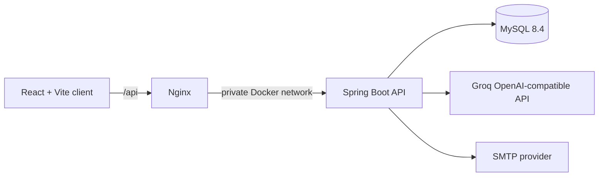

# SmartDesk

SmartDesk is a role-based IT service management platform. Employees submit and track support requests, IT agents manage the service queue, and administrators govern users, categories, audit activity, and operational metrics. The platform also includes a Groq-backed AI assistant, a knowledge base, attachments, comments, email verification, password recovery, and Docker deployment.

## Features

| Role          | Capabilities                                                                                                                                                                                   |
| ------------- | ---------------------------------------------------------------------------------------------------------------------------------------------------------------------------------------------- |
| Employee      | Register and verify an account, create tickets with attachments, track status, add comments, use the knowledge base, chat with the AI assistant, and create a ticket from a chat conversation. |
| IT agent      | Review the shared queue, own tickets, update status and priority, resolve incidents, collaborate through comments, and use operational workload views.                                         |
| Administrator | View service analytics, manage users and service categories, review audit logs, and access all shared service-management resources.                                                            |

Additional features include JWT-based authentication, email verification and password reset, attachment download, role-aware navigation, persisted AI chat conversations, AI ticket assistance, responsive light/dark UI, and role-specific dashboard charts.

## Architecture



- **Frontend:** React 19, Vite, React Router, Axios, custom CSS and SVG dashboard charts.
- **Backend:** Java 25, Spring Boot 4.1, Spring Security, Spring Data JPA, Spring AI, Maven Wrapper.
- **Database:** MySQL 8.4 in Docker; a local MySQL instance is supported for development.
- **Production edge:** Nginx serves the single-page application and proxies `/api` to the private backend container.

## Repository Layout

```text
smartdesk/
├── backend/                 Spring Boot API
│   ├── src/main/java/       Controllers, services, security, entities
│   ├── src/main/resources/  Application configuration and profiles
│   ├── Dockerfile
│   └── pom.xml
├── frontend/                React/Vite single-page application
│   ├── src/pages/           Role dashboards and feature pages
│   ├── src/components/      Shared UI components
│   ├── Dockerfile
│   └── nginx.conf
├── docs/                    Project documentation
├── mockups/                 Design references
├── SmartDeskSQL.sql         Optional demonstration seed data
├── docker-compose.yml       Full production-like local stack
├── .env.example             Docker Compose environment template
└── DEPLOYMENT.md            Deployment operations reference
```

## Prerequisites

### Local development

- Java Development Kit 25
- Node.js 22 or later with npm
- MySQL 8 or compatible server

### Container deployment

- Docker Desktop with Docker Compose v2

## Quick Start: Local Development

### 1. Configure backend secrets

Copy the safe environment template:

```powershell
Copy-Item backend\.env.example backend\.env
```

Set the values in `backend/.env`. Do not commit this file.

### 2. Start MySQL

Create a `smartdesk` database and configure the `DB_*` values in `backend/.env`, or use the local defaults configured in `backend/src/main/resources/application.yaml`.

### 3. Start the backend

PowerShell example using the installed Java 25 runtime:

```powershell
$env:JAVA_HOME = "C:\Users\jh1\AppData\Local\jdks\jdk-25.0.2"
$env:Path = "$env:JAVA_HOME\bin;$env:Path"
Set-Location backend
.\mvnw.cmd spring-boot:run
```

The API listens on `http://localhost:8080`.

### 4. Start the frontend

In another terminal:

```powershell
Set-Location frontend
npm ci
npm run dev
```

Open `http://localhost:5173`. Vite proxies `/api` calls to the backend during development.

## Quick Start: Docker Compose

1. Copy `.env.example` to `.env` in the repository root.
2. Replace every placeholder with a real, unique secret.
3. Start the stack:

```powershell
docker compose up -d --build
```

Open `http://localhost` by default. Change `APP_PORT` in `.env` to use another host port.

```powershell
docker compose ps
docker compose logs -f backend
docker compose down
```

The Compose stack exposes only the frontend port. Nginx proxies API traffic to the backend, and MySQL remains private within the Docker network.

## Environment Variables

### Local backend: `backend/.env`

| Variable             | Required                  | Purpose                                                                 |
| -------------------- | ------------------------- | ----------------------------------------------------------------------- |
| `DB_URL`             | No                        | JDBC URL; local defaults are provided.                                  |
| `DB_USERNAME`        | No                        | Database username; defaults to `root` locally.                          |
| `DB_PASSWORD`        | No                        | Database password; defaults to `root` locally.                          |
| `JWT_SECRET`         | Yes for real environments | Secret used to sign JWTs. Use a random value of at least 64 characters. |
| `GROQ_API_KEY`       | Yes for AI replies        | Groq API key used through Spring AI's OpenAI-compatible client.         |
| `GMAIL_USERNAME`     | Yes for email flows       | SMTP account address.                                                   |
| `GMAIL_APP_PASSWORD` | Yes for email flows       | SMTP application password.                                              |
| `APP_FRONTEND_URL`   | No                        | Browser origin allowed by CORS; defaults to `http://localhost:5173`.    |

### Docker Compose: root `.env`

Use [.env.example](.env.example) as the source of truth. In addition to the application variables, it defines `MYSQL_DATABASE`, `MYSQL_ROOT_PASSWORD`, and `APP_PORT`.

Never commit secrets, production credentials, or API keys. Rotate any key that has been exposed in a terminal, chat, screenshot, or commit history.

## Application Routes

| Route                     | Access        | Purpose                                                          |
| ------------------------- | ------------- | ---------------------------------------------------------------- |
| `/login`, `/register`     | Public        | Authentication and account onboarding.                           |
| `/dashboard`              | Authenticated | Redirects to the dashboard for the current role.                 |
| `/employee/dashboard`     | Authenticated | Employee service-request overview.                               |
| `/agent/dashboard`        | IT agent      | Queue and workload overview.                                     |
| `/admin/analytics`        | Administrator | Operations analytics and category management.                    |
| `/admin/users`            | Administrator | User lifecycle management.                                       |
| `/admin/audit-logs`       | Administrator | Audit history.                                                   |
| `/tickets`, `/ticket/:id` | Authenticated | Ticket list and detailed workflow.                               |
| `/create-ticket`          | Employee      | Ticket submission with attachments.                              |
| `/knowledge-base`         | Authenticated | Knowledge base browse, read, and authorized editing.             |
| `/ai/chat`                | Authenticated | AI assistant, saved conversation history, and ticket escalation. |
| `/settings`               | Authenticated | User settings.                                                   |

## API Overview

All backend endpoints are prefixed with `/api`.

| Resource        | Representative endpoints                                                                                                 |
| --------------- | ------------------------------------------------------------------------------------------------------------------------ |
| Authentication  | `POST /auth/register`, `/auth/login`, `/auth/verify-email`, `/auth/forgot-password`, `/auth/reset-password`              |
| Tickets         | `POST /tickets`, `GET /tickets`, `GET /tickets/{id}`, assignment, status, priority, resolution, and attachment endpoints |
| Ticket comments | `GET` and `POST /tickets/{ticketId}/comments`                                                                            |
| Knowledge base  | `GET /knowledge-base`, `GET /knowledge-base/{id}`, create, update, and delete routes                                     |
| AI assistant    | `POST /ai/chat`, `GET /ai/chat`, `GET /ai/chat/{conversationId}`, `POST /ai/chat/ticket`                                 |
| Administration  | `/users`, `/agents`, `/admin/users/*`, `/categories`, `/audit-logs`                                                      |

Authenticated calls use a JWT stored by the frontend and sent as a `Bearer` token.

## Data and Demo Content

`SmartDeskSQL.sql` contains optional SQL queries and sample users, categories, tickets, and comments. It is not run automatically.

> Warning: the script includes `DROP DATABASE smartdesk` and demo credentials. Review, remove destructive commands, and change all sample credentials before using any part of it outside a disposable local database.

For Docker Compose, the application uses Hibernate schema updates because database migrations are not yet included. Add a migration tool such as Flyway or Liquibase before managing shared production data at scale.

## Validation

Run the current automated checks from the repository:

```powershell
# Backend: compile, test, and Maven verification
$env:JAVA_HOME = "C:\Users\jh1\AppData\Local\jdks\jdk-25.0.2"
$env:Path = "$env:JAVA_HOME\bin;$env:Path"
Set-Location backend
.\mvnw.cmd clean verify -q

# Frontend: static checks and production build
Set-Location ..\frontend
npm run lint
npm run build
```

Current coverage includes one Spring Boot application-context test. The frontend has linting and production-build validation, but no dedicated unit or browser E2E test suite yet.

## Production Readiness Notes

- Use the `prod` Spring profile supplied by Docker Compose.
- Configure a real `APP_FRONTEND_URL` for the deployed public origin.
- Use managed secret storage or Docker/host secrets rather than checked-in files.
- Back up the MySQL volume and test restore procedures.
- Configure HTTPS at the public ingress or reverse proxy.
- Add database migrations, browser E2E tests, monitoring, and alerting before a public internet deployment.
- Resolve current frontend lint warnings and the large JavaScript bundle warning as part of ongoing hardening.

## Troubleshooting

| Symptom                                     | Resolution                                                                                                                        |
| ------------------------------------------- | --------------------------------------------------------------------------------------------------------------------------------- |
| `UnsupportedClassVersionError`              | The project targets Java 25. Set `JAVA_HOME` and `Path` to a JDK 25 installation before Maven commands.                           |
| Backend cannot reach MySQL                  | Confirm MySQL is running, the database exists, and the `DB_*` values are correct. For Compose, check `docker compose logs mysql`. |
| AI replies with a fallback error            | Verify `GROQ_API_KEY`, outbound network access, the configured Groq model, and backend logs.                                      |
| Email verification or reset does not arrive | Verify Gmail SMTP credentials and use an application password, not the normal Gmail password.                                     |
| Docker commands cannot connect              | Start Docker Desktop and wait for the Linux container engine before running Compose.                                              |

## License

No license has been specified for this repository.
